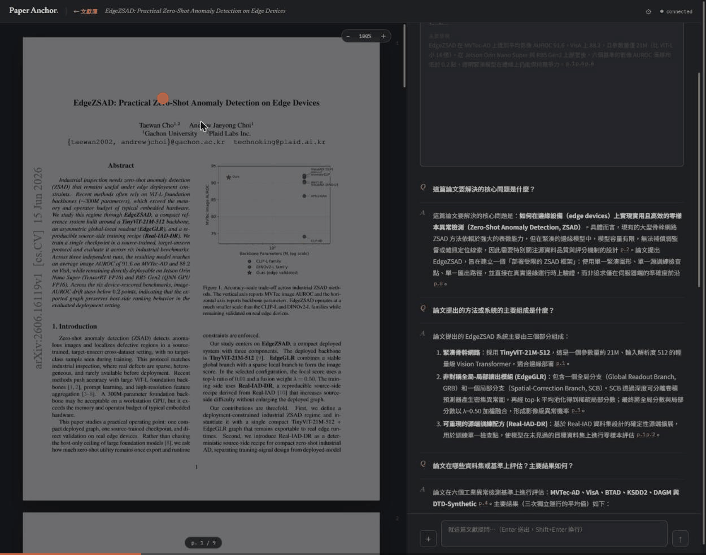

# ⚓ Paper Anchor · 文獻導讀

> **每個回答，都錨定在原文上。**
> 與 LLM「在同一篇文獻上」共讀的雙欄閱讀器——AI 回答中的每個論斷都是可點擊的引用，一鍵跳回 PDF 原文並精準高亮。

[English README](README.md)



## 為什麼不是又一個「跟 PDF 聊天」工具？

多數工具給你無法驗證的答案。Paper Anchor 的核心信念是：**無法追溯到原文的回答是負債，不是功能。**

- **引用錨點**——回答中每個論斷帶 `[C12]` 標記，點擊即跳到對應頁面並以 bbox 精度高亮原文區塊（不是只給頁碼）。引用完整性由自動化評測守護（內建測試集 15/15）。
- **選取提問**——在 PDF 上圈選任一段，一鍵「解釋／翻譯／質疑／提問」，選取段落與前後文強制進入檢索。
- **自動導讀**——上傳即生成結構化導讀（研究問題／方法／發現／貢獻／限制），每個要點可跳轉原文。
- **誠實設計**——文獻沒寫的就明說「文獻中未提及」，不編造。
- **自架 + 自帶金鑰（BYOK）**——PDF 不離開你的機器（除了送往你自選的 LLM 供應商）；任何 OpenAI 相容 API 皆可用；`docker compose up` 一鍵啟動。
- **雙語**——介面與回答語言一鍵切換中／英。

## 快速開始

需求：Docker（含 compose）、一把 [NVIDIA NIM](https://build.nvidia.com/) API key（免費額度）或任何 OpenAI 相容供應商的 key。

```bash
git clone https://github.com/<you>/paper-anchor && cd paper-anchor
cp .env.example .env      # 填入 LLM_API_KEY 與 EMBED_API_KEY
docker compose up -d      # web :5173 / api :8000（皆綁定 127.0.0.1）
```

打開 http://localhost:5173，上傳一篇 PDF 論文。

對外埠預設只綁 `127.0.0.1`（僅本機）——對外開放前請先讀[部署假設](#部署假設)。資料庫埠預設完全不對主機公開，api 走 Compose 內網連 db。

### 換模型／換供應商

全部由 `.env` 控制：

```ini
LLM_BASE_URL=...          # 任何 OpenAI 相容 chat endpoint
LLM_CHAT_MODEL=...
EMBED_BASE_URL=...        # embedding 供應商（可與 chat 不同家）
EMBED_MODEL=...
EMBED_DIM=1024            # 需同步 DB 的 VECTOR 維度；pgvector 索引上限 2000
```

注意：NIM 的 embedding API 需要 `input_type` 參數（入庫 `passage`／查詢 `query`），`llm.py` 已處理；換供應商時留意。

### 用 Claude 訂閱額度

如果你有 Claude Pro/Max/Team/Enterprise 訂閱，可以讓 chat 走方案額度而非計費 API key：

1. 在本機執行 `claude setup-token`（來自 [Claude Code](https://docs.claude.com/en/docs/claude-code)），複製它印出的一年效期 token。
2. 到設定頁「Chat LLM」區塊切換為 **Claude 訂閱**，把 token 貼上。

連上後，chat 會改由 Claude Agent SDK 驅動、吃你訂閱方案內含的額度；串流、引用跳轉、工具呼叫的行為與 OpenAI 相容後端完全一致。（`setup-token` 是 Anthropic 官方唯一背書的登入方式——本專案不內建任何逆向的 OAuth 端點。）

此功能僅涵蓋 chat；embedding 仍需 NIM 或其他 OpenAI 相容供應商的 key（見上方 `EMBED_*`），訂閱額度不含 embedding。

提醒：訂閱額度依 Anthropic 消費者條款僅限個人自用，請勿用這個後端承接共用或正式環境流量。

### 本地 Embedding（免 NIM）

如果你有 Claude 訂閱但沒有 NVIDIA NIM key，Paper Anchor 可以用內建本地模型 (BAAI/bge-m3, 1024 維) 處理文獻嵌入，對話與嵌入一起用訂閱額度——**完全不需要 NIM key**。

#### 使用方式

1. `.env` 中**不設定 `EMBED_API_KEY`**（或留空）
2. 在設定頁 **Embedding 來源** 選擇 **本地模型**（或切換 chat 到 Claude 訂閱時自動使用本地）
3. 上傳文獻、提問、生成導讀、備份還原——全程零 NIM 依賴

如已填 NIM key，可於設定頁切換 Embedding 來源至「本地模型」強制使用本地，**切換後需按一鍵重建全庫索引**重新嵌入既有文獻（防混模型向量污染檢索）。

#### 注意事項

- **首次使用本地模式需網路下載**：模型檔約 2.2GB，下載到 docker volume 快取（重建容器不重下載）；若下載失敗可稍後重試。
- **機器需求**：建議至少 4GB 記憶體；常駐使用約 1.6GB，峰值 2.5GB。
- **推論速度**：CPU 嵌入一篇論文（5–20 章）約 10–30 秒；與 NIM 延遲相近。
- **備份與還原**：備份格式 v2 已內含向量（base64 編碼）——還原時若 embedding 來源相符可秒級完成、無需重嵌；若來源切換過，系統自動重嵌既有文獻（同上述「一鍵重建」）。

### 雲端備份（Google Drive）

在設定頁連接自己的 Google Drive，可以手動或定時把 PDF、標註、翻譯表與對話資料**單向備份**到雲端（非同步同步）。備份是增量式的：遠端已存在的 PDF 不會重複上傳。

#### Google OAuth client 申請步驟

1. 進入 [Google Cloud Console](https://console.cloud.google.com/)
2. 建立新專案 → 進入該專案
3. **APIs & Services** → **Enable APIs and Services** → 搜尋並啟用 **Google Drive API**
4. **OAuth consent screen** → User Type 選 **External** → **Publishing status 務必設為「In production」**（重要：停留在 Testing 模式下 refresh token 會每 7 天自動過期，導致備份連線反覆中斷）
5. **Credentials** → **Create Credentials** → **OAuth client ID** → Application type 選 **Desktop app** → 建立
6. 複製 **Client ID** 與 **Client Secret**
7. 在本程式設定頁「備份」區塊，貼上 client ID 與 secret，儲存後點「連接 Google Drive」——會跳轉授權頁；授權後自動回傳

#### 注意事項

- **本機開發與本機部署**：授權流程預期瀏覽器與伺服器在同一台機器（redirect URL 為 `http://localhost:8000/...`），開箱即用。
- **遠端主機部署**：若伺服器部署在遠端，在本機執行 `ssh -L 8000:遠端IP:8000 -L 5173:遠端IP:5173 user@遠端主機`，保持 SSH 連線開啟，再用瀏覽器訪問 `http://localhost:5173` 進行授權。
- **單向備份語意**：本機刪除文獻**不會**刪除 Google Drive 上的備份檔案；備份會記錄該次備份時點的全量狀態。

## 技術棧

FastAPI · PostgreSQL + pgvector · PyMuPDF｜React · TypeScript · PDF.js｜RAG 手寫（無 LangChain）｜Docker Compose

## 文件

| 文件 | 內容 |
|---|---|
| [docs/01-requirements.md](docs/01-requirements.md) | 需求分析與驗收指標 |
| [docs/02-architecture.md](docs/02-architecture.md) | 架構：引用錨點設計、chunking、資料模型、API 規格 |
| [docs/03-roadmap.md](docs/03-roadmap.md) | 里程碑實錄 |
| [CLAUDE.md](CLAUDE.md) | 開發守則（含 AI 協作開發規範） |
| [CONTRIBUTING.md](CONTRIBUTING.md) | 貢獻指南 |

## 開發

```bash
docker compose exec api pytest                              # 後端測試
docker compose exec api ruff check .                        # lint
docker compose exec web npx tsc -b                          # 型別檢查
docker compose exec api python -m scripts.eval_citations    # 引用命中率回歸（會呼叫 LLM）
```

## 疑難排解

- **第一個字很久才出現（20–40 秒）**——預設的 `deepseek-v4-flash` 是推理模型，思考段算在內；在意延遲可換非推理模型。
- **`ResourceExhausted` 錯誤**——NIM 免費端點限流；系統會自動退避重試，仍失敗按「重試」。
- **切到背景分頁後 PDF 停止渲染**——瀏覽器會暫停背景分頁的 requestAnimationFrame，切回即續跑，屬正常行為。
- **掃描版 PDF**——無文字層，暫不支援 OCR，上傳會明確報錯。

## 部署假設

Paper Anchor 以**單機、單使用者、可信環境**為前提設計。兩條假設寫進了架構，部署前務必知悉：

1. **無認證，信任邊界＝網路。** API 本身不做登入。因此 `docker compose` 把 api（`:8000`）與 web（`:5173`）埠**只綁 `127.0.0.1`**（僅本機），並**不對主機公開資料庫埠**——api 走 Compose 內網連 Postgres。秘密（LLM key、Google OAuth token 等）存於 DB `settings` 表、由 API 層遮罩，所以「不把 DB 埠開到主機」很重要。無 body 的 state-changing `POST` 端點加了最小 CSRF 防護：要求 `Content-Type: application/json`，而跨站 HTML 表單設不了此 content-type（會觸發不被允許的 CORS preflight）。這**不能**取代認證。
2. **單一 worker／process。** backup/restore/reingest 的互斥鎖與 `settings_store` 快取皆為 per-process 的記憶體狀態。請勿以多 worker（`--workers N` 或多副本）啟動——併發互斥與執行期設定更新會靜默失效。啟動時若偵測到 `WEB_CONCURRENCY > 1` 會記警告日誌。

### 要對外／區網開放時

- 在 API 前放**能做認證的反向代理**（並加 TLS）；別直接開放裸埠。偶爾遠端存取建議走 SSH tunnel（見上方備份章節）。
- **更換預設資料庫密碼**（`docker-compose.yaml` 的 `paper`/`paper`）。注意：既有部署改密碼需重建 `pgdata` volume（密碼在首次初始化時就寫進 volume）——當成全新安裝處理。
- 維持單 worker。

完整清單見 [docs/reviews/M4.md](docs/reviews/M4.md)。

### 直連資料庫

DB 埠預設不公開。要用 `psql`／GUI 連線，可用 `docker compose exec db psql -U paper paper_reader`，或把 `docker-compose.yaml` 中 `db` 服務下的 `ports` 區塊取消註解（綁 `127.0.0.1:5432`）。從主機跑 Postgres 測試層也需同樣取消註解——見 [backend/tests/README.md](backend/tests/README.md)。

## 授權

[MIT](LICENSE)
